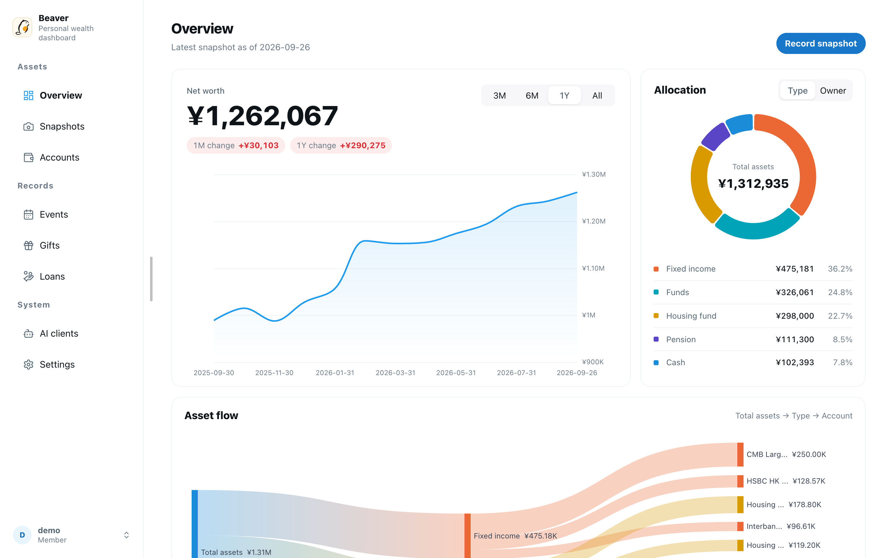
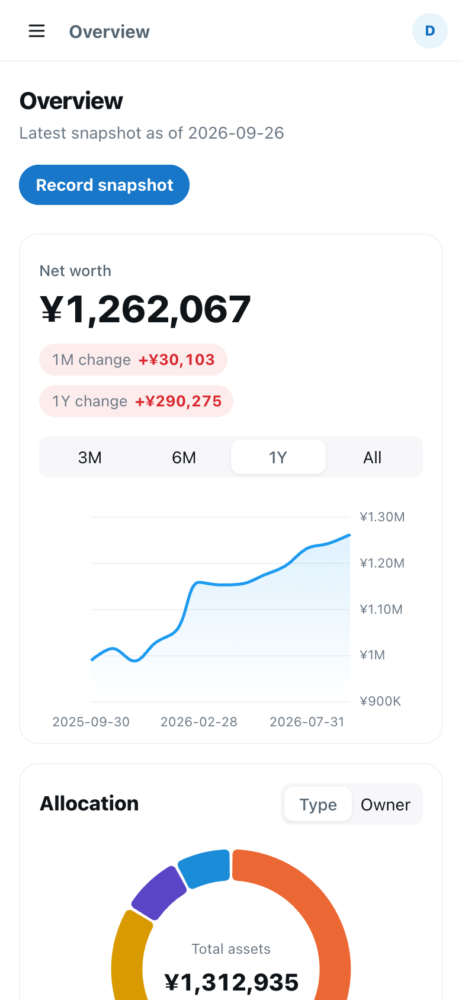
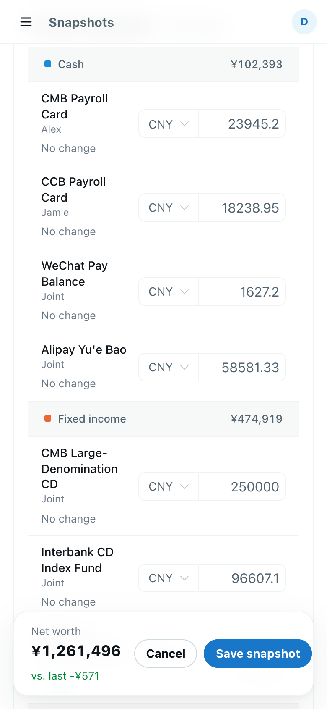
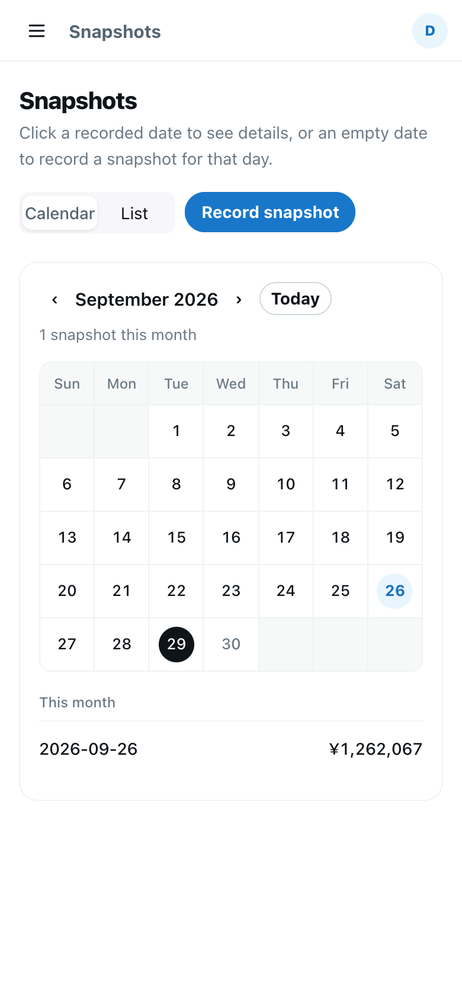

<div align="center">


# Beaver

**A self-hosted household wealth dashboard built on periodic snapshots, with an MCP server so AI assistants can analyse your finances.**

[中文](README.md) · English

</div>



Beaver is not a transaction-by-transaction ledger. Every now and then (say, at month end) you take a **snapshot**: the balance of each account on that day, plus a few notable income or spending events. It takes minutes, yet it is enough to see how your net worth moves, how your assets are allocated and where the money went.

## Features

- **Snapshots**: browse them as a calendar or a list. New snapshots are pre-filled with the previous balances, so you only change what moved.
- **Overview dashboard**: net worth trend, allocation (by type or owner), an asset-flow chart, stacked trends by type, account shares within a type, and changes since the last snapshot.
- **Multi-currency**: accounts can be held in CNY, USD or HKD and are converted to CNY at the snapshot date's rate. Rates are fetched automatically from several public sources that back each other up, and can be entered by hand.
- **Events**: record big-ticket items such as renovations, trips or bonuses, with yearly and per-category statistics.
- **Gift book and loans**: track gifts given, money lent to others and repayments, kept separate from asset statistics.
- **AI clients (MCP)**: a built-in remote MCP server lets agents such as Claude Code and Codex read your data after OAuth authorization. Review and revoke access from the web UI.
- **Multi-user**: admins create member accounts; account types, owners and event categories are customizable.
- **Chinese and English UI**: follows the browser language and can be switched manually.
- **Mobile friendly**: tables become cards on phones, and the app is tuned for iOS "Add to Home Screen".
- **Export and backups**: a CSV export endpoint (`GET /api/v1/export/csv`) and an automatic database backup before every deploy.

<table>
  <tr>
    <td></td>
    <td></td>
    <td></td>
  </tr>
</table>

## Tech stack

| Part | Technology |
|---|---|
| Backend `backend/` | Spring Boot 3, MyBatis, SQLite, Flyway (migrations run on startup) |
| Frontend `frontend-vue/` | Vue 3, Vite, TypeScript, Naive UI, Pinia, ECharts, vue-i18n |
| Deployment | Docker Compose (`backend` + `caddy`); Caddy serves the frontend and reverse-proxies the API; domains and HTTPS are left to your own reverse proxy |
| CI/CD | GitHub Actions: backend tests, frontend type check and build, publish images to GHCR, then deploy over SSH by pulling them |

## Getting started (local development)

Requires Java 21+ and Node.js 20.19+ (or 22.12+).

```bash
# 1. Start the backend (port 8080, database at backend/data/zero.db)
cd backend
./mvnw spring-boot:run

# 2. In another terminal, start the frontend (port 5173, /api is proxied to 8080)
cd frontend-vue
npm ci
npm run dev
```

Open http://localhost:5173. The first visit takes you to a setup page where you create the admin account.

### Demo data

`scripts/seed_demo_data.py` generates a complete demo dataset for a user: about two years of monthly snapshots, accounts in USD and HKD, events, gifts and loans.

```bash
# Wipe this user's data in the local database and rebuild the demo (backs up the database first)
python3 scripts/seed_demo_data.py --reset --user <username> --locale en

# Chinese demo data
python3 scripts/seed_demo_data.py --reset --user <username>

# Remove only the rows written by the script
python3 scripts/seed_demo_data.py --clean --user <username>
```

By default `--reset` only runs against databases under `backend/data/`, so it cannot wipe production data by accident.

### Tests

```bash
cd backend && ./mvnw test          # backend unit tests (use JDK 21, same as CI)
cd frontend-vue && npm run build   # frontend type check + build
```

## Deployment

In production Beaver runs with Docker Compose, and the database lives in the Docker volume `zero_data` (`/data/zero.db` inside the container).

1. Clone the repository on the server and create `.env` in the root:

   ```dotenv
   FRONTEND_ORIGIN=https://app.example.com
   JWT_ACCESS_SECRET=<long random string>
   JWT_REFRESH_SECRET=<another long random string>
   ```

2. Run the deploy script:

   ```bash
   ./scripts/deploy.sh
   ```

   It pulls the images built by CI (`ghcr.io/hammercloth/beaver-backend` and `beaver-web`, amd64 and arm64; nothing is compiled on the server), **backs up the database** to `backups/zero-<timestamp>.db` (keeping the latest 10), then starts the new version. If any step fails, it brings the previous backend back up.

   Beaver then listens on `http://127.0.0.1:8080` only (change the port with `BEAVER_PORT`).

3. To serve it on a domain over HTTPS, put a reverse proxy (Caddy, Nginx, …) in front of `127.0.0.1:8080` that forwards `X-Forwarded-Proto` and `X-Forwarded-Host`. With Caddy it is two lines:

   ```caddyfile
   app.example.com {
     reverse_proxy 127.0.0.1:8080
   }
   ```

4. Optional: enable automatic deploys with GitHub Actions. Set the repository secrets `DEPLOY_HOST`, `DEPLOY_USER`, `DEPLOY_SSH_KEY` and `DEPLOY_PATH`, and the repository variable `ENABLE_AUTO_DEPLOY=true`. Every push to `main` that passes the tests is then deployed.

Server setup, domains and HTTPS, firewalls, restoring from a backup and troubleshooting are covered in [docs/DEPLOYMENT.md](docs/DEPLOYMENT.md) (Chinese).

> ⚠️ Never run `docker compose down -v` or delete the `zero_data` volume: that deletes the database.

## Connecting AI clients (MCP)

The MCP endpoint is `https://<your-domain>/mcp`. It uses the OAuth 2.0 authorization code flow with PKCE and only works with existing accounts; there is no sign-up. The token an agent receives can only call `/mcp`, not the regular API.

```bash
# Claude Code
claude mcp add --transport http beaver https://app.example.com/mcp
# then run /mcp inside Claude Code, pick beaver and finish the browser login

# Codex: add to ~/.codex/config.toml
#   [mcp_servers.beaver]
#   url = "https://app.example.com/mcp"
codex mcp login beaver
```

Available tools:

| Tool | Purpose |
|---|---|
| `get_analysis_guide` | Explains the snapshot-based data model and its limits so the AI interprets the data correctly |
| `list_snapshots` | Lists the current user's snapshots |
| `get_asset_snapshot` | Returns the latest snapshot, or one by ID or date |
| `get_major_financial_events` | Lists events within a snapshot date range |

Once authorized, the **AI clients** page shows when each client was last used and lets you revoke it at any time. Claude Desktop setup, troubleshooting and the related endpoints are described in [docs/MCP.md](docs/MCP.md) (Chinese).

## Project structure

```text
backend/          Spring Boot backend: src/main/java/com/zero/, Flyway migrations, tests
frontend-vue/     Vue 3 frontend (the active one)
  src/views/      pages
  src/i18n/       translations: locales/<locale>/<namespace>.ts
scripts/          deploy.sh (deploy + backup), seed_demo_data.py (demo data), diagnostics
docs/             deployment docs and screenshots
openspec/         feature specs (specs/) and archived changes (changes/archive/)
Caddyfile         static site and /api, /mcp, /oauth reverse proxy
docker-compose.yml
```

## Contributing

- Commit messages follow [Conventional Commits](https://www.conventionalcommits.org/), e.g. `feat(vue): ...`, `fix(backend): ...`.
- Schema changes go in a new `backend/src/main/resources/db/migration/V<n>__<description>.sql`; never edit a released migration.
- New UI text needs both locales: `frontend-vue/src/i18n/locales/zh-CN/<namespace>.ts` and `en-US/<namespace>.ts`, used via `import { t } from '@/i18n'`.
- Add a regression test when fixing a bug where possible. For UI changes include screenshots and check that phone widths have no horizontal scrolling.
- See [AGENTS.md](AGENTS.md) for more conventions.

## License

[MIT](LICENSE)
