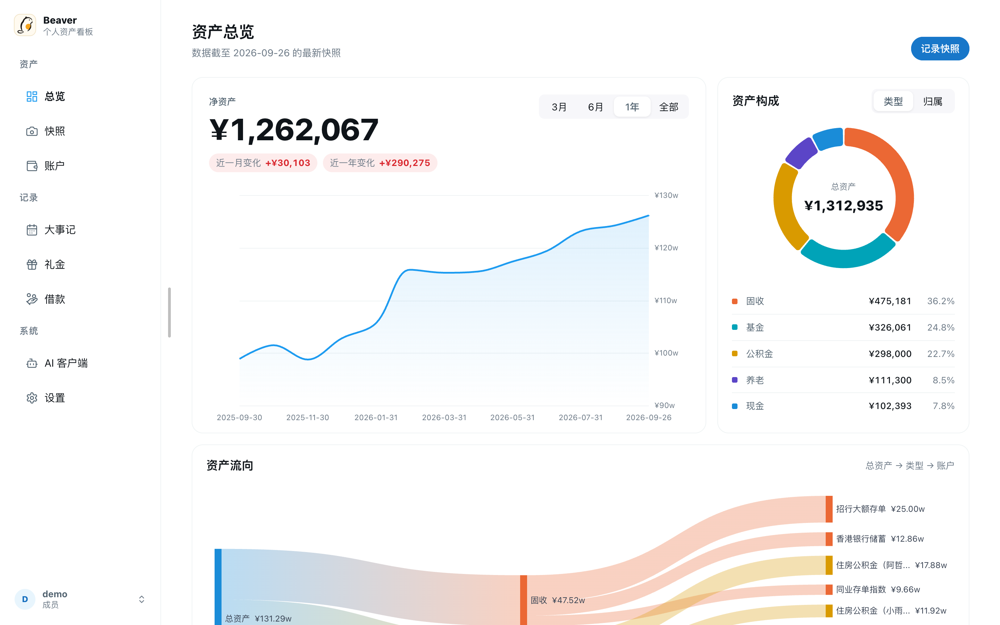
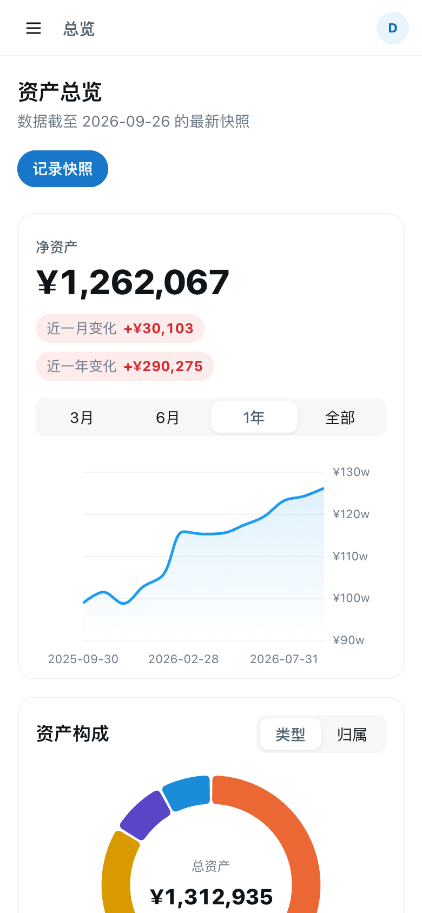
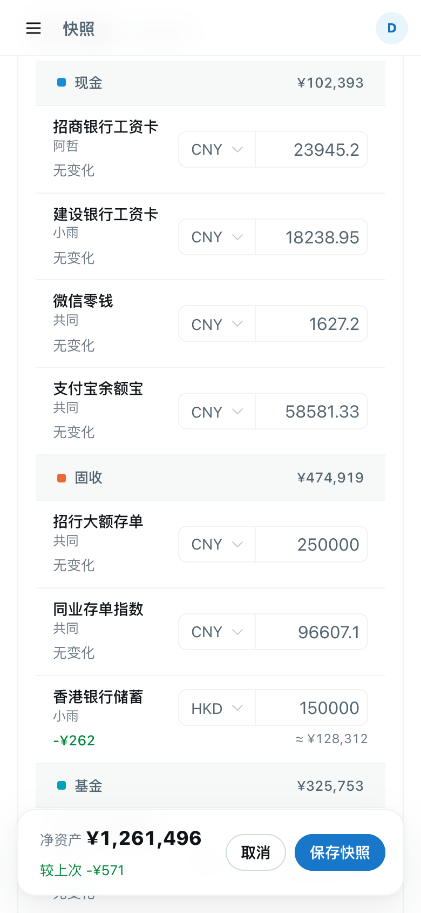
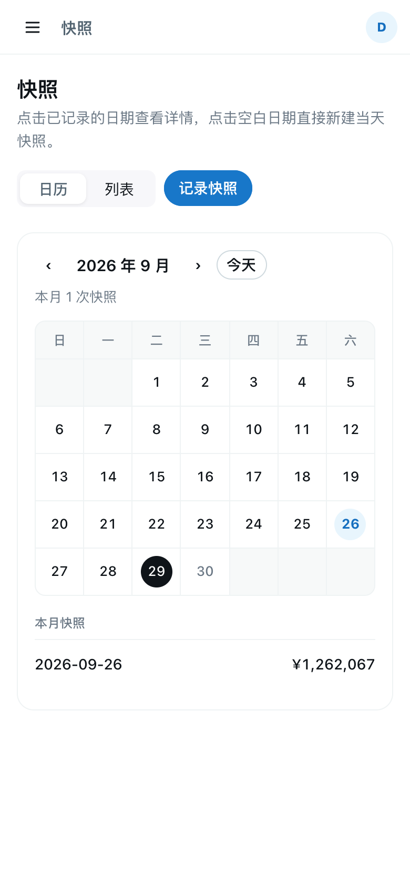

<div align="center">


# Beaver

**用「快照」管理家庭资产的自托管看板，并通过 MCP 让 AI 帮你分析财务。**

中文 · [English](README.en.md)

</div>



Beaver 不做逐笔记账，而是定期（比如每月月底）给所有账户拍一张「资产快照」，只记每个账户当天的余额，再加上这段时间的几笔大事。几分钟就能记完，却足以看清净资产走势、资产结构和钱花在了哪里。

## 功能

- **资产快照**：以日历或列表浏览历次快照；新建时自动预填上一次的余额，只改有变化的账户。
- **总览看板**：净资产趋势、资产构成（按类型或归属）、资产流向图、各类型堆叠走势、类型内各账户占比，以及与上次快照相比的变化。
- **多币种**：账户可用人民币、美元、港币记账，按快照日期的汇率折算成人民币；汇率自动从多个公开数据源获取并互为备份，也可以手动填写。
- **大事记**：记录装修、旅行、年终奖等大额收支，按年度、分类统计。
- **礼金簿与借款**：记录人情往来、别人向你借的钱和分批还款，独立于资产统计。
- **AI 客户端（MCP）**：内置远程 MCP 服务，Claude Code、Codex 等 AI Agent 通过 OAuth 授权后读取你的资产数据；可在网页上查看和撤销授权。
- **多用户**：管理员创建成员账号；账户类型、归属、大事记分类都可以自定义。
- **中英文界面**：跟随浏览器语言，也可以手动切换。
- **手机友好**：手机上表格自动变成卡片；适配 iOS「添加到主屏幕」，可以像 App 一样使用。
- **数据导出与备份**：提供 CSV 导出接口（`GET /api/v1/export/csv`），部署前自动备份数据库。

<table>
  <tr>
    <td></td>
    <td></td>
    <td></td>
  </tr>
</table>

## 技术栈

| 部分 | 技术 |
|---|---|
| 后端 `backend/` | Spring Boot 3、MyBatis、SQLite、Flyway（启动时自动迁移） |
| 前端 `frontend-vue/` | Vue 3、Vite、TypeScript、Naive UI、Pinia、ECharts、vue-i18n |
| 部署 | Docker Compose（`backend` + `caddy`），Caddy 发前端静态文件并把接口转给后端；域名与 HTTPS 交给你自己的反向代理 |
| CI/CD | GitHub Actions：后端测试、前端类型检查与构建，构建并发布镜像到 GHCR，再 SSH 到服务器拉取部署 |

## 快速开始（本地开发）

需要 Java 21+、Node.js 20.19+（或 22.12+）。

```bash
# 1. 启动后端（端口 8080，数据库在 backend/data/zero.db）
cd backend
./mvnw spring-boot:run

# 2. 另开一个终端，启动前端（端口 5173，/api 会代理到 8080）
cd frontend-vue
npm ci
npm run dev
```

打开 http://localhost:5173 ，第一次访问会进入初始化页面，创建管理员账号。

### 演示数据

`scripts/seed_demo_data.py` 可以为指定用户生成一整套演示数据：约两年的月度快照、带美元和港币的账户、大事记、礼金和借款。

```bash
# 清空该用户在本地库里的数据并重建演示数据（会先自动备份数据库）
python3 scripts/seed_demo_data.py --reset --user <用户名>

# 英文版演示数据
python3 scripts/seed_demo_data.py --reset --user <用户名> --locale en

# 只删除脚本写入的演示数据
python3 scripts/seed_demo_data.py --clean --user <用户名>
```

`--reset` 默认只允许作用于 `backend/data/` 下的数据库，避免误删线上数据。

### 测试

```bash
cd backend && ./mvnw test          # 后端单元测试（请用 JDK 21，与 CI 一致）
cd frontend-vue && npm run build   # 前端类型检查 + 构建
```

## 部署

生产环境用 Docker Compose 运行，数据库放在 Docker 卷 `zero_data` 中（容器内 `/data/zero.db`）。

1. 在服务器上克隆仓库，在根目录创建 `.env`：

   ```dotenv
   FRONTEND_ORIGIN=https://app.example.com
   JWT_ACCESS_SECRET=<随机长字符串>
   JWT_REFRESH_SECRET=<另一个随机长字符串>
   ```

2. 执行部署脚本：

   ```bash
   ./scripts/deploy.sh
   ```

   脚本会拉取 CI 构建好的镜像（`ghcr.io/hammercloth/beaver-backend` 与 `beaver-web`，支持 amd64 / arm64，服务器上不编译），**先备份数据库**到 `backups/zero-<时间>.db`（默认保留最近 10 份），再启动新版本；任一步失败都会重新拉起原来的后端。

   启动后 Beaver 只在本机 `http://127.0.0.1:8080` 提供服务（端口可用 `BEAVER_PORT` 修改）。

3. 用域名和 HTTPS 访问：在前面放一个反向代理（Caddy、Nginx 等）指向 `127.0.0.1:8080`，并让它转发 `X-Forwarded-Proto` 和 `X-Forwarded-Host`。Caddy 只要两行：

   ```caddyfile
   app.example.com {
     reverse_proxy 127.0.0.1:8080
   }
   ```

4. 可选：配置 GitHub Actions 自动部署。在仓库 Secrets 中设置 `DEPLOY_HOST`、`DEPLOY_USER`、`DEPLOY_SSH_KEY`、`DEPLOY_PATH`，并把仓库变量 `ENABLE_AUTO_DEPLOY` 设为 `true`，之后每次推送到 `main`、测试通过后会自动部署。

服务器初始化、域名与 HTTPS、防火墙、从备份恢复、常见问题等，见 [docs/DEPLOYMENT.md](docs/DEPLOYMENT.md)。

> ⚠️ 不要执行 `docker compose down -v` 或删除 `zero_data` 卷，那会删掉数据库。

## 接入 AI 客户端（MCP）

Beaver 的 MCP 地址是 `https://<你的域名>/mcp`，使用 OAuth 2.0 授权码 + PKCE 登录，只能用已有账号授权，不开放注册。AI 拿到的令牌只能访问 `/mcp`，不能访问普通接口。

```bash
# Claude Code
claude mcp add --transport http beaver https://app.example.com/mcp
# 然后在 Claude Code 里输入 /mcp，选择 beaver 完成浏览器登录

# Codex：在 ~/.codex/config.toml 中加入
#   [mcp_servers.beaver]
#   url = "https://app.example.com/mcp"
codex mcp login beaver
```

提供的工具：

| 工具 | 作用 |
|---|---|
| `get_analysis_guide` | 说明快照式数据模型和数据限制，帮助 AI 正确解读 |
| `list_snapshots` | 列出当前用户的所有快照 |
| `get_asset_snapshot` | 获取最新、指定 ID 或指定日期的快照 |
| `get_major_financial_events` | 按快照日期范围查询大事记 |

授权后可以在网页的「AI 客户端」页查看每个客户端的最后使用时间，并随时撤销。Claude Desktop 的接入方式、授权排查和相关接口见 [docs/MCP.md](docs/MCP.md)。

## 项目结构

```text
backend/          Spring Boot 后端：src/main/java/com/zero/、Flyway 迁移、测试
frontend-vue/     Vue 3 前端（当前使用的版本）
  src/views/      页面
  src/i18n/       国际化：locales/<语言>/<命名空间>.ts
scripts/          deploy.sh（部署与备份）、seed_demo_data.py（演示数据）、诊断脚本
docs/             部署文档、截图
openspec/         功能规格说明（specs/）与已归档的变更（changes/archive/）
Caddyfile         静态站点与 /api、/mcp、/oauth 反向代理
docker-compose.yml
```

## 参与开发

- 提交信息遵循 [Conventional Commits](https://www.conventionalcommits.org/)，例如 `feat(vue): ...`、`fix(backend): ...`。
- 数据库结构变更新增 `backend/src/main/resources/db/migration/V<序号>__<说明>.sql`，不要修改已发布的迁移。
- 新增界面文字时，中英文词条都要加：`frontend-vue/src/i18n/locales/zh-CN/<命名空间>.ts` 和 `en-US/<命名空间>.ts`，代码里用 `import { t } from '@/i18n'`。
- 修复 bug 时尽量补上回归测试；UI 改动请附截图，并在手机尺寸下检查没有横向滚动。
- 更多约定见 [AGENTS.md](AGENTS.md)。

## 许可证

[MIT](LICENSE)
